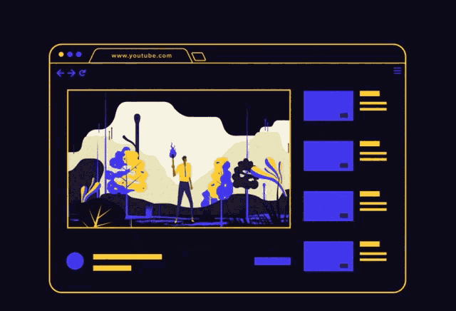

> This README is intentionally human-written TwT.

# Hey there, I'm **Aniket** 👋

Computer Science undergraduate at **SOA University, Bhubaneswar**, passionate about building intelligent systems that combine **AI**, **backend engineering**, **creativity**, and **human-centered problem solving**.

I enjoy developing full-stack applications, experimenting with AI integrations, and designing systems that solve real-world challenges through automation, accessibility, and scalable architecture. My work currently revolves around **NLP**, **intelligent workflows**, **multimodal AI systems**, and **modern web technologies**.

I believe technology becomes impactful when strong engineering meets communication, creativity, and empathy.

---

<h2>🚀 What I Work On</h2>

* AI-powered applications and intelligent automation.
* Full-stack web development.
* Backend systems and scalable architectures.
* NLP, multimodal interaction, and GPT integrations.
* Progressive Web Apps (PWAs).
* Human-centered tech solutions.

## 🛠️ Tech Stack

### 💻 Languages

  
  
  
  
  
  

### 🌐 Frontend

  
  
  
  
  

### 🧩 Backend & Databases

  
  
  
  
  
  

### 🧠 AI & Intelligent Systems

  
  
  
  
  

### 🎨 Tools & Platforms

  
  
  
  
  
  

---

## 🌟 Featured Work

### 🧠 Manas Swasthya

An AI-powered mental wellness platform featuring:

- Emotion-aware journaling.
- Voice, text, and image-based interaction.
- Medicine AI assistance.
- Multilingual support.
- Offline-ready PWA architecture.
- Integrated peer and professional support systems.

### 🎙 Native Voice AI

A multilingual AI localization system concept focused on:

* Speech recognition.
* Neural translation.
* AI dubbing pipelines.
* Lip-synced temporal alignment.
* Culturally adaptive localization workflows.

---

## 🎤 Beyond Tech

Outside development, I’m deeply involved in:

* Debating and Model United Nations.
* Public speaking and anchoring.
* Radio hosting.
* Music and guitar.
* Storytelling and media production.

---

## Connect with me

---

## GitHub Statistics
# 📊 GitHub Stats:
 
 

## 🏆 GitHub Trophies

### Dev Quotes

## Listen to my favorite music

  <kbd>AI</kbd> <kbd>Stories</kbd> <kbd>Music</kbd> <kbd>Debate</kbd> <kbd>Anchor</kbd>

---

